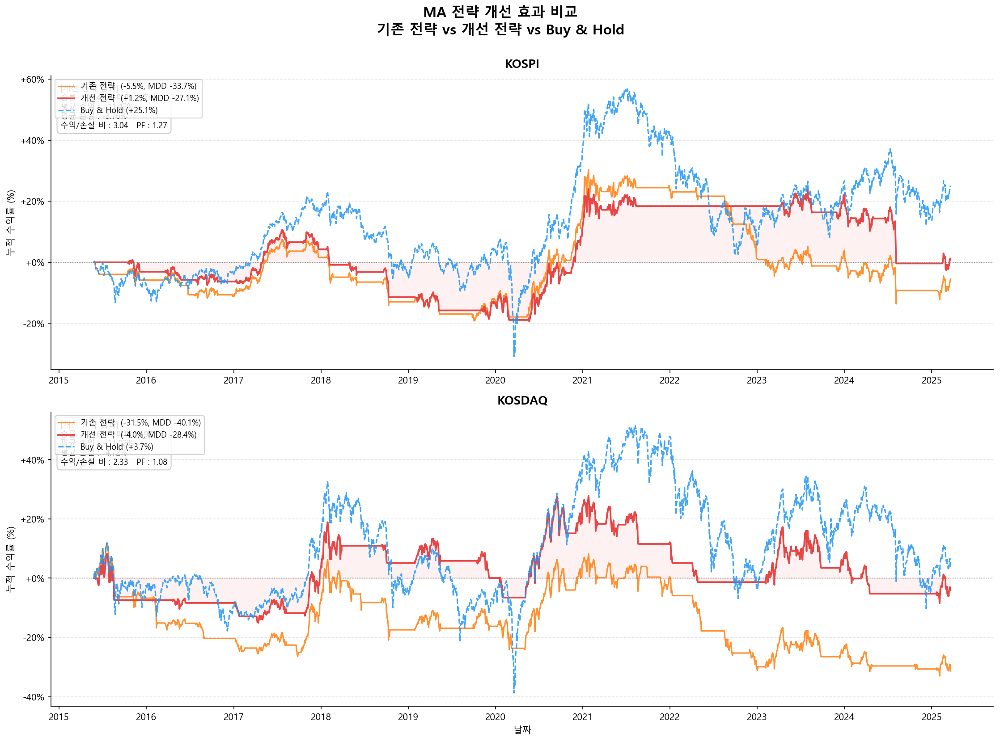
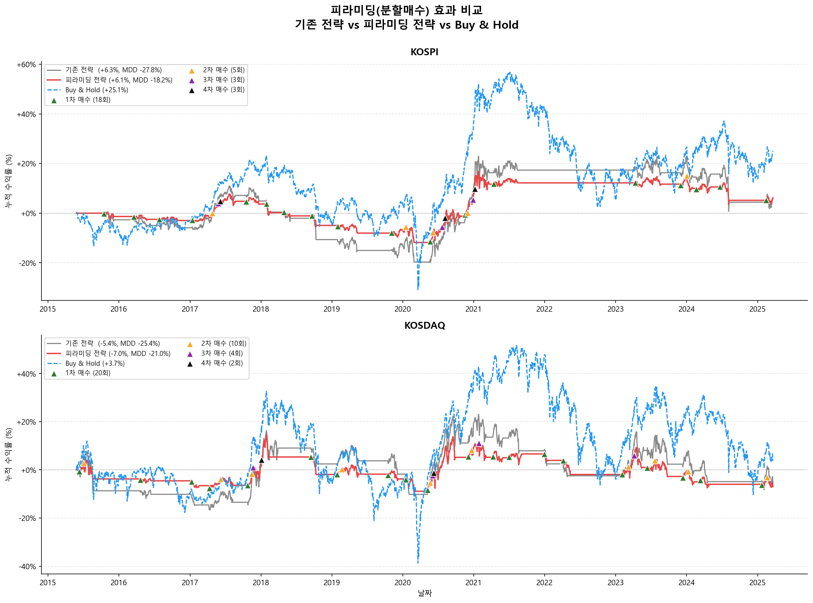

# Quant Strategy Backtests

KOSPI / KOSDAQ 지수와 대형주를 대상으로 한 **이동평균·모멘텀 기반 퀀트 전략 백테스트** 모음입니다.
yfinance로 받은 공개 시세 데이터를 사용하며, 단순한 이동평균 교차 전략에서 출발해 필터·손절·피라미딩을 더해 가며 개선한 과정을 담고 있습니다.

## 폴더 구성

```
.
├── 부자되는 첫걸음/        # 입문: KOSPI 이동평균 전략
│   ├── pythonimport yfinance as yf.py   # KOSPI 10년 데이터 수집 + MA20/60 교차 전략
│   ├── MA.py                            # MA 교차 + 추세 강도 + 변동성 필터 (포지션 0 / 0.5 / 1)
│   ├── 240 480MA.py                     # 장기 이평(240일·480일) 단순 돌파 vs 돌파+지지 전략
│   └── ```python.md                     # 전략 코드 메모
├── 안티그래비티/
│   └── import pandas as pd.ini          # MA20/60 교차 전략 최소 구현 스니펫
├── 제미나이/               # 심화: 개선 전략과 종목 단위 모멘텀 전략
│   ├── Untitled-1.py                    # KOSPI·KOSDAQ 10년 데이터 수집 및 MA 계산
│   ├── backtest_improved.py             # 개선된 MA 교차 전략 + 피라미딩 비교
│   ├── backtest_momentum.py             # KOSPI 200 상대 모멘텀 + 추세 추종
│   ├── backtest_kosdaq.py               # KOSDAQ 150 상대 모멘텀 + 추세 추종
│   ├── kospi_10y.csv / kosdaq_10y.csv   # 수집한 지수 일봉 데이터
│   └── 사진/                            # 백테스트 결과 차트
├── ap1.py / api.py         # Tiingo API 연동 실험 (API 키는 keyring / 환경변수로 관리)
```

## 주요 전략

### 1. 이동평균 교차 (기본)
- MA20 > MA60 이면 보유, 아니면 현금
- 미래 데이터 참조를 막기 위해 포지션은 항상 `shift(1)` 적용
- 비교 기준: 단순 보유(Buy & Hold)

### 2. 개선된 이동평균 교차 (`제미나이/backtest_improved.py`)
| 구분 | 조건 |
|---|---|
| 진입 | 종가 > 최근 20일 최고가, MA20 > MA60, ADX(14) 5일 평균 ≥ 25 |
| 청산 | MA20이 MA60 하향 돌파, 또는 매수가 대비 -5% 손절 |
| 재진입 | 손절 후 새 골든크로스 전까지 금지 |
| 비용 | 매매당 0.1% |
| 피라미딩 | 1차 진입 후 +5%, +5%, 52주 신고가에서 분할 추가 매수 / -10% 트레일링 스탑 |

### 3. 상대 모멘텀 + 추세 추종 (`backtest_momentum.py`, `backtest_kosdaq.py`)
- 유니버스: KOSPI 200 시총 상위 50종목 / KOSDAQ 150 주요 종목
- 매월 말 6개월 모멘텀 상위 10종목을 후보로 선정
- 진입: 20일 신고가 + 골든크로스 + ADX(14) ≥ 25 (익일 시가)
- 청산: 데드크로스 또는 -5% 손절 (익일 시가)
- 종목당 비중 10%, 빈 슬롯은 현금
- 왕복 비용: KOSPI 0.2%, KOSDAQ 0.3%

## 결과 예시

| 개선 전략 vs 기존 전략 | 피라미딩 비교 |
|---|---|
|  |  |

| KOSPI 모멘텀 | KOSDAQ 모멘텀 |
|---|---|
|  |  |

## 실행 방법

```bash
pip install yfinance pandas numpy matplotlib
python 제미나이/backtest_improved.py
```

결과 차트는 각 스크립트가 있는 폴더(또는 `제미나이/사진/`)에 저장됩니다.
Tiingo 예제(`api.py`)를 쓰려면 `TIINGO_API_KEY` 환경변수에 본인 API 키를 넣고 실행하세요.

## 한계

- 현재 지수 구성종목 기준 유니버스라 **생존 편향**이 있습니다.
- 슬리피지와 유동성은 반영하지 않았습니다.
- 학습용 백테스트이며 투자 권유가 아닙니다.
