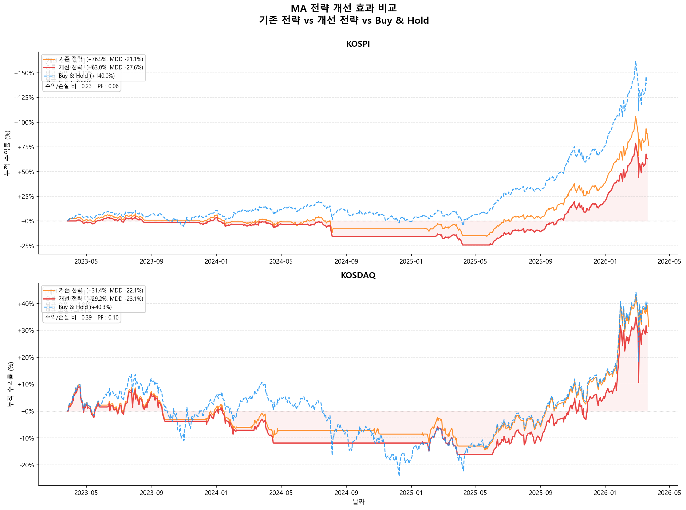
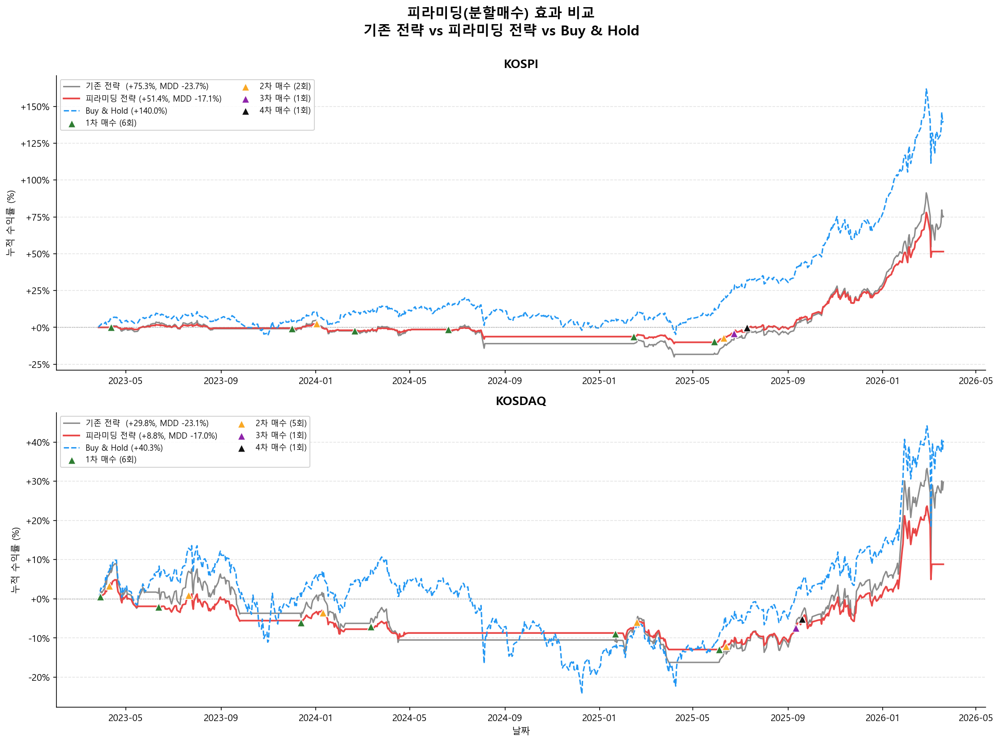
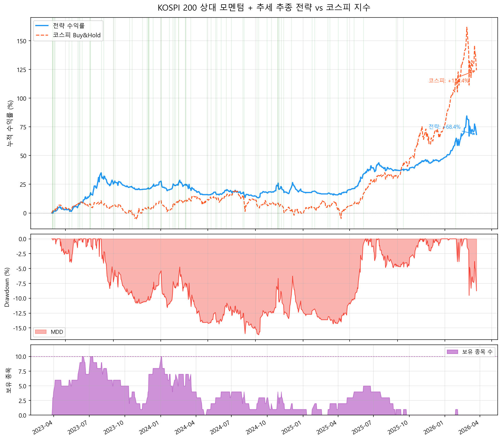
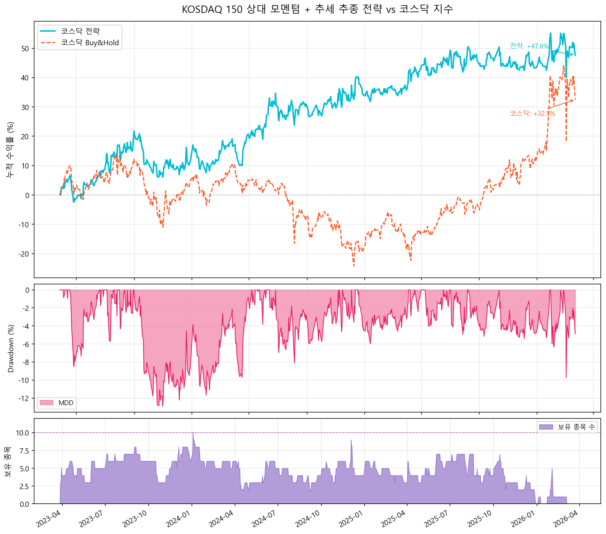

# Quant Strategy Backtests

KOSPI / KOSDAQ 지수와 대형주를 대상으로 한 **이동평균·모멘텀 기반 퀀트 전략 백테스트** 모음입니다.
yfinance의 공개 시세 데이터를 사용했습니다. 단순한 이동평균 교차 전략에서 출발해 거래비용, 진입 필터, 손절, 피라미딩, 종목 선정(상대 모멘텀)을 차례로 더해 가며 학습한 과정을 단계별 폴더로 정리했습니다.

## 학습 단계별 구성

| 단계 | 폴더 | 내용 |
|---|---|---|
| 01 | [`01_moving_average_basics/`](01_moving_average_basics) | KOSPI 지수로 이동평균 전략 기초 익히기 |
| 02 | [`02_index_ma_crossover/`](02_index_ma_crossover) | KOSPI·KOSDAQ 두 지수에 거래비용을 반영한 MA 교차 백테스트 |
| 03 | [`03_improved_ma_strategy/`](03_improved_ma_strategy) | 돌파·ADX 필터와 손절로 MA 전략 개선, 피라미딩(분할매수) 추가 |
| 04 | [`04_momentum_portfolio/`](04_momentum_portfolio) | 지수 대신 개별 종목을 고르는 상대 모멘텀 포트폴리오 |
| — | [`extras/tiingo_api/`](extras/tiingo_api) | Tiingo 시세 API 연동 실험 |

```
.
├── 01_moving_average_basics/
│   ├── ma_crossover_20_60.py          # MA20 > MA60 이면 보유
│   ├── ma_trend_volatility_filter.py  # MA 교차 + 추세 강도 + 변동성 필터 (포지션 0 / 0.5 / 1)
│   └── long_term_ma_240_480.py        # 장기 이평(240·480일) 단순 돌파 vs 돌파+지지(3일)
├── 02_index_ma_crossover/
│   ├── kospi_kosdaq_ma_crossover.py   # 두 지수 10년 데이터 수집 + MA20/60 교차 (수수료 0.1%)
│   ├── data/                          # 수집한 지수 일봉 CSV
│   └── results/
├── 03_improved_ma_strategy/
│   ├── improved_ma_pyramiding.py      # 기존 vs 개선 vs 피라미딩 비교
│   └── results/
├── 04_momentum_portfolio/
│   ├── kospi200_momentum.py           # KOSPI 200 시총 상위 50종목 대상
│   ├── kosdaq150_momentum.py          # KOSDAQ 150 주요 종목 대상
│   └── results/
├── extras/tiingo_api/
│   ├── save_api_key.py                # 환경변수의 API 키를 OS keyring에 저장
│   └── list_tickers.py                # keyring의 키로 Tiingo 종목 목록 조회
└── compute_metrics.py                 # 아래 성과 비교표 재현 스크립트
```

## 성과 비교: 전략 vs Buy & Hold

모든 값은 [`compute_metrics.py`](compute_metrics.py)로 각 스크립트의 일별 자산곡선에 **같은 공식**을 적용해 계산했습니다.

- **CAGR**: 최종 배수 ^ (1 / 달력 연수) − 1
- **MDD**: 고점 대비 최대 낙폭
- **샤프 비율**: 일간 수익률 평균 / 표준편차 × √252 (무위험수익률 0)

### 01. 이동평균 기초 — KOSPI, 2016-09-30 ~ 2026-09-23, 거래비용 미반영

| 전략 | CAGR | MDD | 샤프 |
|---|---:|---:|---:|
| MA20/60 교차 | +9.70% | -34.83% | 0.60 |
| MA + 추세/변동성 필터 | +10.16% | **-28.49%** | **0.71** |
| MA240 단순 돌파 | +10.37% | -38.63% | 0.60 |
| MA240 돌파+지지(3일) | +10.02% | -38.63% | 0.59 |
| MA480 단순 돌파 | +9.04% | -38.63% | 0.55 |
| MA480 돌파+지지(3일) | +8.89% | -38.63% | 0.54 |
| **Buy & Hold** | **+13.26%** | -43.90% | 0.65 |

> 01 단계 스크립트는 실행일 기준 최근 10년 데이터를 받으므로, 다시 실행하면 수치가 조금씩 달라집니다.

### 02. 지수 MA 교차 + 거래비용 — 2015-05-27 ~ 2025-03-21, 수수료 0.1%

| 시장 | 전략 | CAGR | MDD | 샤프 |
|---|---|---:|---:|---:|
| KOSPI | MA20/60 교차 | -0.58% | -33.73% | 0.00 |
| KOSPI | **Buy & Hold** | **+2.33%** | -43.90% | **0.22** |
| KOSDAQ | MA20/60 교차 | -3.91% | -40.85% | -0.19 |
| KOSDAQ | **Buy & Hold** | **+0.29%** | -53.79% | **0.13** |

### 03. 개선 전략과 피라미딩 — 2023-03-27 ~ 2026-03-20, 수수료 0.1%

| 시장 | 전략 | CAGR | MDD | 샤프 |
|---|---|---:|---:|---:|
| KOSPI | MA20/60 교차 | +20.92% | -21.14% | 1.04 |
| KOSPI | 개선 전략 (돌파 + ADX + -5% 손절) | +20.73% | -23.74% | 1.05 |
| KOSPI | 피라미딩 (분할매수 + -10% 트레일링) | +14.94% | **-17.06%** | 1.09 |
| KOSPI | **Buy & Hold** | **+34.12%** | -20.67% | **1.41** |
| KOSDAQ | MA20/60 교차 | +9.58% | -22.09% | 0.55 |
| KOSDAQ | 개선 전략 | +9.13% | -23.11% | 0.54 |
| KOSDAQ | 피라미딩 | +2.87% | **-16.96%** | 0.28 |
| KOSDAQ | **Buy & Hold** | **+12.04%** | -33.29% | **0.57** |

### 04. 상대 모멘텀 포트폴리오 — 2023-03-27 ~ 2026-03-23, 왕복 비용 KOSPI 0.2% / KOSDAQ 0.3%

| 시장 | 전략 | CAGR | MDD | 샤프 |
|---|---|---:|---:|---:|
| KOSPI | KOSPI 200 모멘텀 (71회 거래) | +19.03% | **-16.15%** | **1.32** |
| KOSPI | Buy & Hold (지수) | **+31.04%** | -20.67% | 1.30 |
| KOSDAQ | KOSDAQ 150 모멘텀 (99회 거래) | **+16.79%** | **-11.22%** | **0.96** |
| KOSDAQ | Buy & Hold (지수) | +9.88% | -33.29% | 0.49 |

### 정리

- **추세추종 전략은 MDD를 줄이는 데는 대체로 성공했지만, CAGR은 대부분 Buy & Hold보다 낮았습니다.** 특히 2023~2026년처럼 강한 상승장에서는 현금 보유 구간 때문에 수익을 크게 놓쳤습니다.
- 02단계에서 수수료 0.1%만 반영해도 잦은 교차 매매 때문에 MA20/60 전략은 10년 수익이 마이너스가 됐습니다. 거래비용을 반드시 반영해야 한다는 것을 확인했습니다.
- 03단계의 필터와 손절은 매매 횟수를 줄였지만 성과 개선은 크지 않았습니다. 피라미딩은 MDD를 가장 크게 줄인 대신 수익도 가장 많이 줄었습니다.
- 수익률과 위험을 함께 볼 때 Buy & Hold를 확실히 앞선 것은 **KOSDAQ 150 모멘텀**(CAGR·MDD·샤프 모두 우위) 하나였습니다. 다만 현재 구성종목 기준 유니버스라 생존 편향이 가장 크게 작용했을 수 있는 전략이기도 합니다.

## 결과 차트

| 03. 개선 전략 vs 기존 전략 (2023~2026) | 03. 피라미딩 비교 (2023~2026) |
|---|---|
|  |  |

| 04. KOSPI 200 모멘텀 | 04. KOSDAQ 150 모멘텀 |
|---|---|
|  |  |

03단계는 2015~2025년 기간으로 실행한 결과(`*_2015_2025.png`)도 [`results/`](03_improved_ma_strategy/results)에 함께 있습니다.

## 실행 방법

```bash
pip install yfinance pandas numpy matplotlib
python 03_improved_ma_strategy/improved_ma_pyramiding.py

# 성과 비교표 재현 (04단계는 종목 데이터를 받느라 수 분 걸립니다)
python compute_metrics.py 01 02 03
python compute_metrics.py 04a
python compute_metrics.py 04b
```

결과 차트는 각 단계 폴더의 `results/`에 저장됩니다.
Tiingo 예제를 쓰려면 `TIINGO_API_KEY` 환경변수에 본인 API 키를 넣고 `extras/tiingo_api/save_api_key.py`를 먼저 실행하세요.

## 한계

- 04단계는 현재 지수 구성종목 기준 유니버스라 **생존 편향**이 있습니다.
- 슬리피지와 유동성은 반영하지 않았고, 01단계는 거래비용도 반영하지 않았습니다.
- 단계마다 백테스트 기간이 달라 단계 간 수치를 직접 비교하기는 어렵습니다. 같은 표 안에서만 비교해 주세요.
- 학습용 백테스트이며 투자 권유가 아닙니다.
